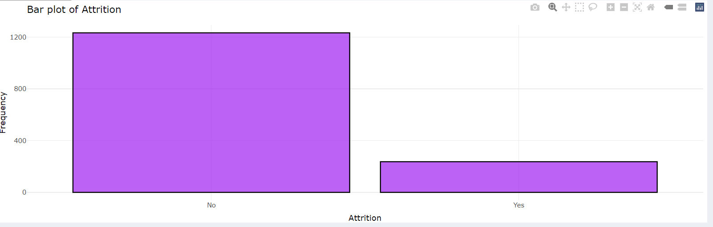
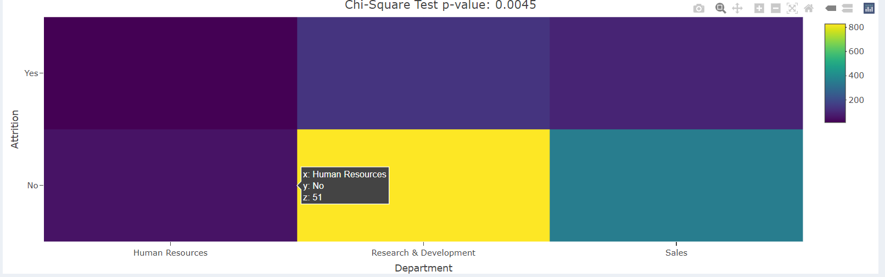

---
---
---

# Description du jeu de données

-   **Dimensions** : Le jeu de données contient 1470 lignes et 13 colonnes.

-   **Valeurs manquantes** : Aucune valeur maquante n'a été détecté après le chargement du jeu de dataset

-   **Outilers** : Sur toutes les colonnes numériques , le nombre d'outliers detectés après le chargement du jeu de données est de 270...

-   Attriton : cette variable répresente notre cible .

Pour avoir un model de meilleur qualité , la correction de ces outliers est nécéssaire ... Ces outliers sont ensuite corrigés pour éviter les problèmes de biais en ne pas perturbant les modèles apprises.

**`Proportion de l'attrition des employées :`**

```{r echo=FALSE}

```

Sur ce graphique, on remarque que la classe "Yes" contient environ 300 points de données, tandis que la classe "No" en compte environ 1200 ou plus. Cela met en évidence un problème de déséquilibre des classes.

Pour pallier ce problème, nous avons implémenté dans l'application quatre techniques de gestion du déséquilibre des données, regroupées en deux types :

-   **Data Level** : Random Under-Sampling et Random Over-Sampling.

-   **Algorithm Level** : Cost-Sensitive Learning et One-Class Learning.

Ces techniques permettent de gérer le problème de déséquilibre des données. Pour ce cas d'étude, il est apparu que, parmi ces méthodes, celles du **Data Level** ont donné les meilleures performances, notamment avec le Random Under-Sampling.

Les résultats des modèles appris seront présentés par la suite.

# Heatmap des corrélations entre variables numériques

Elle permet de mesurer le degré de dépendance ou d'indépendance entre les variables numériques du jeu de données. Elle fournit également un aperçu du degré de corrélation entre ces variables, ce qui est très utile pour identifier les meilleures variables à sélectionner pour des problèmes de machine learning, tels que la régression ou la classification.

```{r echo=FALSE}

```

# Analyse Univariée 

## Analyse des variables numériques : 

Les histogrammes et courbes de fréquence cumulative révèlent des distributions hétérogènes des variables "Âge", "Distance du domicile" et "Années dans l'entreprise", suggérant des proportions variables de chaque catégorie d'âge, de distance et d'ancienneté, ce qui aura un impact significatif sur la construction de modèles prédictifs robustes et précis. En procédant ainsi pour toutes les variables numériques , cela permet de guider dans le choix des variables adéquates pour la formation d'un modèl.

```{r echo=FALSE, fig.show="hold", out.width="100%", out.height="100%"}


```

## Analyse de variables catégorielles 

L'analyse des proportions révèle des déséquilibres significatifs dans la variable cible "Attrition", suggérant un besoin d'équilibrage des données pour améliorer la performance du modèle prédictif. De plus, les proportions élevées de certaines catégories dans les variables explicatives pourraient indiquer des facteurs de risque clés liés à l'attrition.

```{r echo=FALSE, fig.show="hold", out.width="100%", out.height="100%"}


```

# Analyse bivariée

## Variables catégorielles Vs Numériques 

L'analyse des boxplots révèle une légère tendance pour les employés plus âgés à quitter l'entreprise, suggérant que l'âge pourrait être un prédicteur intéressant d'attrition, contrairement à la distance de la maison qui ne semble pas discriminante entre les deux groupes.

```{r echo=FALSE, fig.show="hold", out.width="100%", out.height="100%"}


 
```

## Variables Numériques Versus Variables Numériques 

Les visualisations révèlent une faible corrélation entre les variables numériques, ce qui est encourageant pour la construction de modèles de prédiction. Étudier ces relations permet d'éviter les problèmes de colinéarité et de sélectionner les variables les plus pertinentes pour expliquer la variable cible.

```{r echo=FALSE, fig.show="hold", out.width="100%", out.height="100%"}


 
```

## Variables Catégoriques Versus Variables Catégoriques 

Les deux graphiques représentent des **tables de contingence** qui croisent deux variables catégorielles : "Attrition" (départ de l'entreprise) et respectivement "Département" et "Éducation". Les couleurs indiquent le nombre d'observations dans chaque cellule. Le test du Chi-deux nous permet de déterminer si la distribution des observations est indépendante d'une variable à l'autre.

**Interprétation des résultats :**

-   **Graphique 1 :** Le p-value du test du Chi-deux est très faible (0.0045), ce qui signifie qu'il existe une **association significative** entre l'attrition et le département. Autrement dit, les employés de différents départements ont des probabilités différentes de quitter l'entreprise.

-   **Graphique 2 :** Le p-value est beaucoup plus élevé (0.5455), ce qui indique qu'il n'y a **pas d'association significative** entre l'attrition et le niveau d'éducation.

```{r echo=FALSE, fig.show="hold", out.width="100%", out.height="100%"}

cat("<br>")


```

## Présentation et comparaison des modèls appris :

#### Random Forest versus Decision Trees :

Sur les graphiques ci-dessous, on peut observer l'importance des features pour les modèles appris avec le Random Forest, les résultats de leurs performances, ainsi que la courbe ROC. Les performances globales des deux modèles sont satisfaisantes.

Cependant, en comparant leurs performances, il s'avère que le Decision Tree donne de meilleurs résultats que le Random Forest. Pour ce jeu de données, entre ces deux algorithmes, le modèle le mieux adapté est le Decision Tree.

```{r echo=FALSE, fig.show="hold", out.width="100%", out.height="100%"}


```

#### Decison Trees Versus KNN

```{r echo=FALSE, fig.show="hold", out.width="100%", out.height="100%"}


```

Pour ce jeu de données, il est également évident, en comparant les performances sur les graphiques, que c'est le KNN qui donne les meilleurs résultats. Le meilleur modèle est donc celui du KNN.

#### KNN versus Logistic Regression

```{r echo=FALSE, fig.show="hold", out.width="100%"}


```

Au vu des performances comparées, on peut aisément conclure que le meilleur modèle parmi le KNN et la régression logistique est celui de la régression logistique.

#### Logistic Regression Versus SVM :

```{r echo=FALSE, fig.show="hold", out.width="100%"}


```

Le modèle Logistique est le mieux adapté au vu des performances comparées. Il offre de meilleures précisions avec des valeurs plus cohérentes pour les métriques d'évaluation, et il surpasse le modèle Support Vector Machine en termes de précision.

#### Conclusion :

Sur ce jeu de données, après avoir comparé les performances des différents modèles à travers plusieurs étapes d'évaluation, il ressort que le modèle offrant les meilleurs résultats est celui de Logistic Regression. Cette conclusion est basée sur l'analyse des métriques de performance, telles que la précision, le rappel, l'accuracy, ainsi que la courbe ROC, qui montrent des résultats plus satisfaisants par rapport aux autres modèles testés
